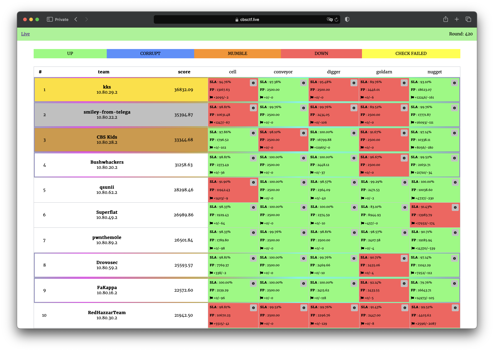

# Gold CTF 2024

The contest was held on February 10, 2024.

Repository contains source code of services, checkers and sploits.

[CTFTime.org event page](https://ctftime.org/event/2249)

## Results

[Full scoreboard](scoreboard/full.png)

## Services

| Service | Language | Checker | Sploits | Authors |
|---------|----------|---------|---------|---------|
| **[cell](services/cell/)** | PHP | [Checker](checkers/cell/) | [Sploits](sploits/cell/) | [@jnovikov](https://github.com/jnovikov) |
| **[conveyor](services/conveyor/)** | Python | [Checker](checkers/conveyor/) | [Sploits](sploits/conveyor/) | [@renbou](https://github.com/renbou) |
| **[digger](services/digger/)** | C++ | [Checker](checkers/digger/) | [Sploits](sploits/digger/) | [@keltecc](https://github.com/keltecc) |
| **[goldarn](services/goldarn/)** | Rust | [Checker](checkers/goldarn/) | [Sploits](sploits/goldarn/) | [@ambientsnd](https://github.com/b1r1b1r1) |
| **[nugget](services/nugget/)** | Go | [Checker](checkers/nugget/) | [Sploits](sploits/nugget/) | [@pomo_mondreganto](https://github.com/pomo-mondreganto) |

## Infrastructure

- DevOps: [@pomo_mondreganto](https://github.com/pomo-mondreganto)
- Checksystem: [ForcAD](https://github.com/pomo-mondreganto/ForcAD)

## Writeups

- [cell](/sploits/cell/)
- [conveyor](/sploits/conveyor/)
- [digger](/sploits/digger/)
- [nugget](/sploits/nugget/)
